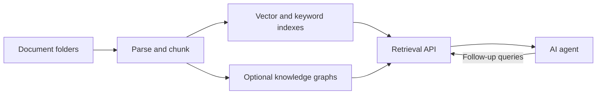

# Carrel

English | [中文](README.zh-CN.md)

[](https://github.com/FengZhenfei/carrel/actions/workflows/tests.yml) [](LICENSE)

**Ontology-Augmented Generation for AI agents.**

Carrel is a self-hosted knowledge base for AI agents. It automates document
parsing, indexing, and retrieval, with optional knowledge graphs. Agents use
its API to retrieve source passages, images, and related facts, then generate
their own answers.

Use it to give an agent access to a collection of product documents, research,
contracts, meeting notes, or other files that change over time. A web console
manages knowledge bases, models, and processing tasks. A bundled
[search skill](skills/carrel-search/SKILL.md) connects agents such as Claude
Code and Codex to the retrieval service.

[Features](#features) · [Quick start](#quick-start) · [Agent integration](#agent-integration) · [Documentation](#documentation)

## Features

- **Document parsing:** PDF, Word, PowerPoint, spreadsheets, images, HTML,
  Markdown, and source code, with processing suited to each format.
- **Automatic updates:** scan for file changes, update indexes, and maintain
  enabled knowledge graphs through scheduled tasks.
- **Hybrid retrieval:** combine vector, keyword, graph, and visual search,
  with automatic knowledge-base selection and optional reranking.
- **Knowledge graphs:** extract entity types, relationships, and facts from
  your documents; retain sources, time information, and conflict indicators.
- **Agent access:** search through an API, fetch surrounding text or original
  images, and follow graph relationships when more evidence is needed.
- **Web console:** configure processing, inspect chunks and graphs, track
  tasks, and manage services. Available in English and Chinese.

## How it works



Carrel uses MinerU and native parsers for ingestion, Qdrant for vectors,
OpenSearch for keywords, and Neo4j for graph queries. SQLite tracks files and
tasks. Model services can run locally or through compatible hosted endpoints.
See [Architecture](docs/architecture.md) for the pipeline and retrieval design.

## Requirements

- Python 3.12+ and Docker 25+ with Compose v2.
- A text embedding endpoint; a vision-language endpoint for image descriptions;
  and a chat model for knowledge graph construction, if enabled.
- An NVIDIA GPU and NVIDIA Container Toolkit to run the optional local model
  stack. CPU parsing is also supported. Resource needs depend on the models
  and collection size.

| Platform | Deployment |
|---|---|
| Linux with NVIDIA GPU | GPU parsing and optional local model services; systemd scheduling |
| Linux without GPU | CPU parsing; connect to model services on another host or a provider |
| macOS with Docker Desktop | CPU containers and native Python services; arrange scheduling separately |
| Windows | Use WSL2; native Windows deployment is not supported |

## Quick start

### 1. Deploy the services

```bash
git clone https://github.com/FengZhenfei/carrel.git
cd carrel
./deploy.sh
```

The script detects the host, starts the infrastructure, installs the Python
app, and creates configuration files. On Linux with user systemd available,
it also enables services and scheduled tasks. Other hosts receive manual
startup commands. First startup downloads the parser models.

### 2. Configure model endpoints

Edit `config/knowledge-base.env` to set the embedding and vision model URLs,
model names, and API keys. The initial URLs point to local model servers;
starting those servers requires the optional local model setup below.

To use the bundled local models, prepare their weights and deploy with
`./deploy.sh --with-local-models`. See [Model configuration](docs/configuration.md#model-endpoints)
and the [local model setup](deployment/compose/README.md#local-model-servers-profile-local-models).
Restart running application services after changing their environment settings.

### 3. Add documents

Open the console at **http://127.0.0.1:9800**. Put documents in
`runtime/mirror/<folder>/`, then enable that folder in the console. Each
enabled folder becomes a knowledge base; scheduled tasks process its files.

For a knowledge graph, register a chat model in the console, select it in the
knowledge-base settings, and enable graph building. Check service health and
task progress in the console before making your first query.

## Agent integration

Install the bundled [carrel-search skill](skills/carrel-search/SKILL.md)
in your agent, or call the API directly:

```bash
curl -sS http://127.0.0.1:9810/search \
  -H 'Content-Type: application/json' \
  -d '{"question": "What are the delivery and acceptance requirements?", "top_k": 8}'
```

If you set `KB_SEARCH_TOKEN`, add an `Authorization: Bearer …` header.
For a remote agent,
configure `CARREL_SEARCH_BASE_URL` and `CARREL_SEARCH_TOKEN` in its environment.

Responses include source passages and, when available, graph evidence and
image information. Agents can request more context, inspect images, and
follow relationships before answering. See [Retrieval and API](docs/retrieval.md)
for authentication, response status, and citations.

## Documentation

| Guide | Contents |
|---|---|
| [Configuration](docs/configuration.md) | Model endpoints, folders, per-base settings, and access control |
| [Architecture](docs/architecture.md) | Parsing, graph construction, retrieval, and code layout |
| [Retrieval and API](docs/retrieval.md) | Agent setup, endpoints, evidence status, and evaluation |
| [Operations and development](docs/operations.md) | Console, CLI, scheduling, troubleshooting, and tests |
| [Docker Compose](deployment/compose/README.md) | Infrastructure, model weights, and container settings |
| [systemd](deployment/systemd/README.md) | Linux services and timers |

## Data and access

The console binds to localhost by default. For LAN access, set both
`KB_WEB_HOST` and `KB_WEB_TOKEN`. Configure `KB_SEARCH_TOKEN` before using
protected search endpoints remotely.

Documents and images are sent to the model endpoints you configure. Local
endpoints keep model processing within your own infrastructure.
See [Access and data handling](docs/configuration.md#access-and-data-handling).

## License

Carrel is licensed under [MIT](LICENSE). Dependencies and model weights have
their own licenses; see [Third-party notices](NOTICE.md). Original-resolution
PDF image retrieval uses an optional dependency installed with
`./deploy.sh --with-pdf-images`; without it, retrieval uses cached images.
