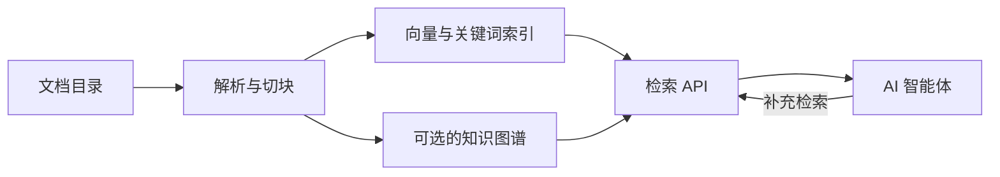

# Carrel

[English](README.md) | 中文

**面向 AI 智能体的本体增强生成（Ontology-Augmented Generation）。**

Carrel 是一个面向 AI 智能体的自托管知识库，自动完成文档解析、索引和检索，并支持可选的知识图谱。智能体通过 API 获取原文、图像和关联事实，再据此组织回答。

你可以用它管理持续更新的产品资料、研究文献、合同、会议纪要等文档。Web 控制台用于管理知识库、模型和处理任务；配套的 [检索 Skill](skills/carrel-search/SKILL.md) 可供 Claude Code、Codex 等智能体接入。

[核心功能](#核心功能) · [快速开始](#快速开始) · [接入智能体](#接入智能体) · [文档](#文档)

## 核心功能

- **多格式解析：** 支持 PDF、Word、PowerPoint、表格、图片、HTML、Markdown 和源代码，按文件格式采用相应的处理方式。
- **自动更新：** 定时发现文件变化，更新索引，并维护已启用的知识图谱。
- **混合检索：** 结合向量、关键词、图谱和视觉检索，支持自动选择知识库及可选的重排序。
- **知识图谱：** 从资料中抽取实体类型、关系和事实，保留来源、时间信息和冲突标记。
- **智能体接口：** 支持检索、补取上下文、查看原图，以及按需追查图谱关系。
- **Web 控制台：** 配置处理策略，预览切块与图谱，查看任务进度和服务状态，支持中英文切换。

## 工作方式



Carrel 使用 MinerU 和原生解析器处理文档，通过 Qdrant 存储向量、OpenSearch 提供关键词检索、Neo4j 支持图谱查询，SQLite 记录文件和任务状态。模型服务可以部署在本地，也可以使用兼容的远程接口。完整流程见 [架构说明](docs/architecture.zh-CN.md)。

## 运行环境

- Python 3.12+、Docker 25+ 和 Compose v2。
- 文本向量接口；处理图片描述时需要视觉语言模型接口；启用建图时需要对话模型接口。
- 运行配套的本地模型服务需要 NVIDIA GPU 和 NVIDIA Container Toolkit。文档解析也支持 CPU，资源需求取决于模型与资料规模。

| 平台 | 部署方式 |
|---|---|
| Linux + NVIDIA GPU | GPU 解析，可选本地模型服务，使用 systemd 调度 |
| Linux 无 GPU | CPU 解析，连接其他主机或供应商提供的模型接口 |
| macOS + Docker Desktop | 容器使用 CPU，Python 应用在主机运行，需自行安排定时调度 |
| Windows | 使用 WSL2，暂不支持原生 Windows 部署 |

## 快速开始

### 1. 部署服务

```bash
git clone https://github.com/FengZhenfei/carrel.git
cd carrel
./deploy.sh
```

脚本会检测运行环境，启动基础服务、安装 Python 应用并生成配置文件。在支持用户级 systemd 的 Linux 环境中，脚本还会安装服务和定时任务；其他环境则输出手动启动命令。首次启动需要下载解析模型。

### 2. 配置模型接口

编辑 `config/knowledge-base.env`，填写文本向量和图片描述模型的地址、模型名称及 API Key。初始地址指向本地模型服务，需另行按下述方式启动，或改为已有服务的地址。

如果使用配套的本地模型，先准备模型权重，再运行 `./deploy.sh --with-local-models`。详见 [模型接口配置](docs/configuration.zh-CN.md#模型接口) 和 [本地模型部署](deployment/compose/README.md#local-model-servers-profile-local-models)。修改环境配置后，需要重启正在运行的应用服务。

### 3. 添加资料

打开控制台 **http://127.0.0.1:9800**。将资料放入 `runtime/mirror/<目录名>/`，然后在控制台启用该目录。每个启用的目录对应一个知识库，文件由定时任务自动处理。

需要知识图谱时，先在控制台注册对话模型，再为知识库选择模型并启用建图。首次检索前，可在控制台确认服务健康状态和任务进度。

## 接入智能体

为智能体安装配套的 [carrel-search Skill](skills/carrel-search/SKILL.md)，或直接调用检索 API：

```bash
curl -sS http://127.0.0.1:9810/search \
  -H 'Content-Type: application/json' \
  -d '{"question": "资料中对交付和验收有哪些要求？", "top_k": 8}'
```

如果设置了 `KB_SEARCH_TOKEN`，请求中需增加 `Authorization: Bearer …` 请求头。智能体部署在其他主机时，在其环境中配置 `CARREL_SEARCH_BASE_URL` 和 `CARREL_SEARCH_TOKEN`。

返回内容包括原文片段，以及可用的图谱证据和图像信息。智能体可以继续补取上下文、查看原图或追查关系，再组织回答。认证、结果状态与引用方式见 [检索与 API](docs/retrieval.zh-CN.md)。

## 文档

| 文档 | 内容 |
|---|---|
| [配置说明](docs/configuration.zh-CN.md) | 模型接口、资料目录、单库设置与访问控制 |
| [架构说明](docs/architecture.zh-CN.md) | 解析、建图、检索流程与代码结构 |
| [检索与 API](docs/retrieval.zh-CN.md) | 智能体接入、接口、证据状态与评测 |
| [运维与开发](docs/operations.zh-CN.md) | 控制台、命令行、定时任务、排障和测试 |
| [Docker Compose](deployment/compose/README.md) | 基础设施、模型权重和容器配置（英文） |
| [systemd](deployment/systemd/README.md) | Linux 服务与定时任务（英文） |

## 数据与访问

控制台默认仅监听本机。局域网访问需同时配置 `KB_WEB_HOST` 和 `KB_WEB_TOKEN`；远程调用受保护的检索接口前，需配置 `KB_SEARCH_TOKEN`。

文档和图片会发送给你配置的模型接口。使用本地接口时，模型处理也在自有基础设施内完成。详见 [访问控制与数据处理](docs/configuration.zh-CN.md#访问控制与数据处理)。

## 许可证

Carrel 采用 [MIT 许可证](LICENSE)。依赖组件和模型权重各自遵循其许可证，见 [第三方声明](NOTICE.md)。检索 PDF 原始分辨率图片需要通过 `./deploy.sh --with-pdf-images` 安装可选依赖；未安装时使用解析缓存中的图片。
